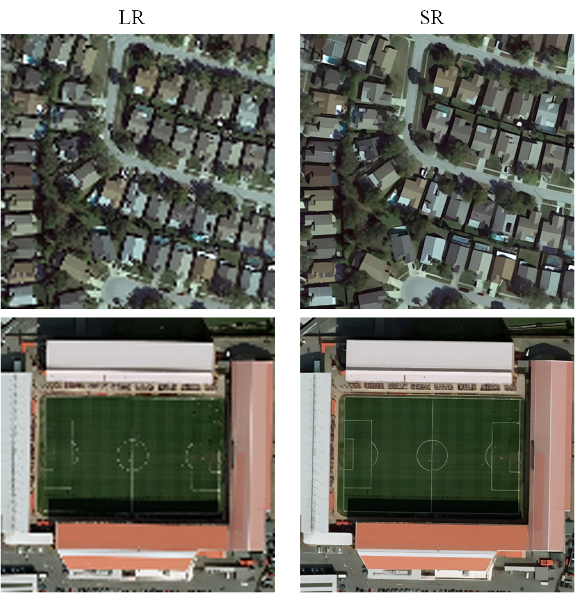

# FAT
A Transformer-based Super Resolution model for remote sensing image

- [ ] Upload the code of FAT
- [x] Upload the dataset RSSR25
- [x] Upload the code of LAM
- [x] Upload the introduction

**The paper was accepted by TGRS 2025, we will upload the code ASAP!!!**

Paper link [https://ieeexplore.ieee.org/document/10912673](https://ieeexplore.ieee.org/document/10912673)

However, another paper was accepted by CVPR, we need some time to deal with the paper, code, dataset, and undergraduate graduation project. 

RSSR25 Datasets: [BaiduCloud](https://pan.baidu.com/s/1Ywy6W6eVLsJ7nVVoKf6HaQ?pwd=4321) 🤗[huggingface](https://huggingface.co/datasets/fengyanzi/RSSR25/tree/main)
 
Additionally, I provide a user-friendly [LAM](https://github.com/fengyanzi/Local-Attribution-Map-for-Super-Resolution) diagnostic tool, that can be run in 2024.

The Local Attribution Map (LAM) is an interpretability tool designed for super-resolution tasks. It identifies the pixels in a low-resolution input image that have the most significant impact on the network’s output. By analyzing the local regions of the super-resolution result, LAM highlights the areas contributing the most to the reconstruction, providing insights into the model's decision-making process.

Currently, I can offer some super-resolution example images.

